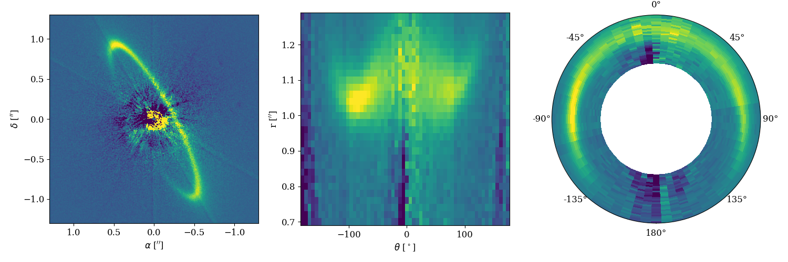
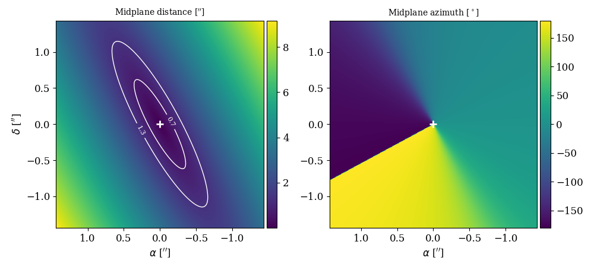

# Deproj

A simple tool to deproject direct imaging observations of debris disks.

In principle it could work for any kind of disks that you are interested in, but since the disk is assumed to be vertically flat, it should be more accurate for debris disks rather than proto-planetary disks.


## Installation

Simply clone the repository and run

```python
python3 setup.py develop
```

and you can then import the class with

```python
from deproj import Deproj
```

The dependencies are `numpy`, `astropy`, and `matplotlib`.

## First example

There are very few parameters that you need to provide to get the deprojected map. Here's a quick use example

```python
disk = Deproj('data_example/HR4796_Qphi_400.fits', nr = 30, nt = 60, pixscale = 0.0072)
# disk = Deproj(qphi, nr = 30, nt = 60, pixscale = 0.0072) # Alternative way to initialize with a 2D array
```

The first argument should either be the name of the fits file containing the observations or directly a 2D array. The observations should have the same number of pixels in both directions. Then, there are the following optional parameters that you can pass:

```python
nr = 30           # Number of radial bins
nt = 60           # Number of azimuthal bins
pixscale = 0.0072 # Size of one pixel in arcsec
```

Afterwards, you can call the main method as

```python
disk.go(amin = 0.7, amax = 1.3, incl = 77.72, pa = -151.59)
```

where the parameters are

```python
amin = 0.7        # The inner radius of the mask
amax = 1.3        # The outer radius of the mask
incl = 77.72      # The inclination of the disk
pa = -151.59      # The position angle of the disk
```

and this will produce the following output:



There are additional parameters that can be passed to the `go` method:

```python
vmin = 1.         # The lower percentile for vmin
vmax = 99.5       # The upper percentile for vmax
cmap = 'viridis'  # The colormap
plim = 1.1        # The extent when plotting the observations (in arcsec)
plot = 'full'     # What to plot, can be either 'full', 'polar', or 'cartesian'
```

To help you better visualize how this works you can also call the following method

```python
disk.debug(amin = 0.7, amax = 1.3, incl = 77.72, pa = -151.59)
```

which will produce the output below



where you can see on the left the distance in the midplane, with the contours showing the inner and outer radii of the mask, while the right panel shows the azimuthal angle in the midplane. The distance map will be binned in `nr` cells, and the azimuth map will be binned in `nt` cells. Since the inclination and position angle of the disk is accounting for in both maps, the deprojection is quite straightforward to do.

## Words of caution

The quality of the deprojection will depend on the values for the inclination and position angle that you provide. As you can see in the example above, the deprojected disk does not appear to be very circular. There are two explanations for this, the first one being that the disk has a known eccentricity, which is not accounted for in this package. The second one is that the disk is assumed to be infinitely flat. That example uses the values derived in [Olofsson et al. (2022)](https://ui.adsabs.harvard.edu/abs/2022MNRAS.513..713O/abstract) where we fitted for the vertical scale height of the disk. As further discussed in [Olofsson et al. (2020)](https://ui.adsabs.harvard.edu/abs/2020A%26A...640A..12O/abstract), this can have an impact on your results.


## To be done

- [x] Install script
- [x] Additional parameters for the plotting, `vmin`, `vmax`, `plim`, `cmap` etc
- [x] Plotting options, only `polar`, only `cartesian`, `full`, etc
- [x] Provide either a file name, or a 2D frame directly
- [ ] Automatic determination of the inclination and position angle? It would increase the dependencies required though.


